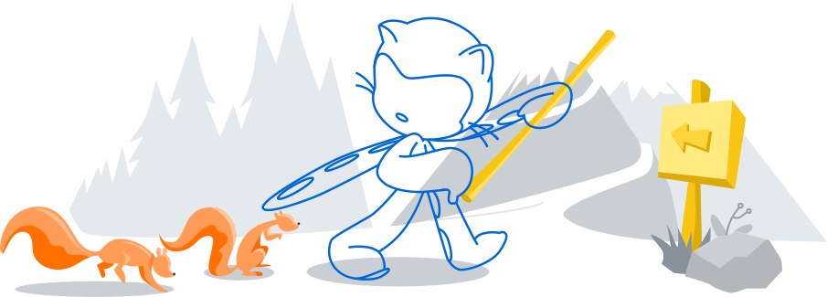

## August Frisk (@AN0NYM0U5MY7H)

<!---------------------------------------------------------------------
- Profile Badges
----------------------------------------------------------------------->

---
### About Me
I am a Computer Science student at Oregon State University. In my free time, I study ethology and contribute to citizen science projects.

 
<!---------------------------------------------------------------------
- Citizen Science Projects
----------------------------------------------------------------------->

### Citizen science contributions around the web.
Observing and identifying biodiversity throughout California's Central Valley and Sierra Nevada mountain range.

[![Global Biotic Interactions badge](https://img.shields.io/badge/GloBI-1867a5?style=flat-square&logo=data:image/png;base64,iVBORw0KGgoAAAANSUhEUgAAACMAAAAjCAYAAAAe2bNZAAAHuUlEQVRYR82Yf2xT1xXHv8/Pvx3/DPlpktCQHwU2YN1oFToGoV2Voq5pB+3YNCnShgiT0CSG1lbqNtZs7djWlT8o2qJ2bWGsYlMrLdJgRO1KQ7eh9Ed+iEBQEpJAEoc4jh07jn+/93befflhx4njSkPakez33r3nnfu5555z7rU5iQT/J8JlC9PY2Ijm5ua7ip01TH19PVpaWj43zM6dO9HW1pbVe1nDyNbOnTuH/fv3Z2VYVrp48SLq6uqy1v9cMOXl5RgcHGTGZ8OX4Jl+GbF4PypL+2Bp/TfuNRnxs8pSPFaQy3QKCwtx586duwMjiH7cHNkCCYmUAarLRqG+8FFKG89xuLX7fhTqtP97mL5b65IgOFhMT0OlMrCBChy/xIT3J+zeG9dgc8duzOeoDBV99KtZAa26TJIURd/t9cyYBBvs5ifYfTwxAo26JA1GgAmD+AESIvBURy98CcWLvke2w6zmM0JlhpEiAKcnmHJMGf8KQVWBL+qvIxK5kGI03/4C3L5jrG2CfxYBQWD3jtBnMOgmUfmJE7N1D0IlcdDw3IpAnCAIkkqlWl5h2Kq0r/PjP14/RPKNLJX4HfOTJMXAcVrkWg9jyv8qa7uJH2PC3Y0qUxybbOPURoObv4O/dE5jaCqK5x4uWhlGLnpHjx5Fb28vLlxImvGwnBHkYuvzgLoY0H4BPbFKTMfjbIBK/JZiJgeiGISKM0NM9CNfvwPnXSUo1onYmpeAyvR10uXRMRpA12gQ7iBH8MCzD6UCjY+Po6ioCCnLdPbsWTQ1NaGv92NgpIzGNFJ+ngc0VYDoA4QpCIIfPT4NtOIZOHQzKMj5HjyR92C3HEJ7wIKemSgOli0OJvvyzMcu5g0ZRqBYOvRgPmwGntUsv9/PnMAR5fIxM++V3FOLLtVtI+9ULzyHIh0Y9bVgQneEtckLvdVqRiCeQJFet6D3brcbwagSxIVmHTrHaGnp/ttVcZSWlqYs2QowSqwIHHmIk8A7rlM4hJQXZW/lfFPupXQ+xtI6k7zV7mJLQ/PGtjIb/n7NT96Rlo2ddJjQ++TPvRC5f1A4KpWUiVoN3kkpLgaA0EWCi8EdakF+3uvkFotMuaDqjsaQP1fs5mHuL7Oz/gSBnCegRzdYscVJE0uSdBjXLiDWicmec0xNY7PBXEpQrIqRl8runXtdwKTvN8izP0f61+jTS91R6hMRFnQw8Ep6f9iTB29Qwtc2RKDTxmA2RHC8/SHYjTwat+evAnOLMkeaXYBZ0CYYyz0FUJtNDGgm1Aqj7ivg+STvJZm+GfSjAOOYCbjRPRhF3RZ5j1K8J8Oo6PaZJVm1egWmVI64xhHqG4AYjUKVCMG4aSsCuW9mjJcbE2HciUawY60NoZgAVyCK6nxTiieWPqTBhF//OS1sHJ/edyBFV0VT0enUsJkN0Hhegs77Jdg21kK/1pnsPPR7IixAq/L0VIc4KpbTqHHYqCSIePszZQc/+O4NqKlv9le1mZcp+s4piB4Xg5GjRE8AzkILbBaC4Hn4gs0QAkMwOprg6xuGr6ML45tqwOu1qKIgLV+jbJ7J8i8CkiVPq8XwSBiPv9WNilwDrj1TkxlGGLqOWOufcXvPjyDojCwt5RrCcfQde4UFsko4gLjezAxpaa+xtH8IdY4ZxpoH0N41wiJDq+WxbXMJ844st0MR3I5EEI2L2PNKF049UY3fH34cV69eRWtrK2pra5cveuE/0BZAJoeflK80ePwkXal0klh9e+DYsBlaNQdp2kOZPgW+eD0CXVcRc43BvqWS6fln47gWnIsRmtH2+0op2FV47LVOvDfgQ/TXu9M8uGwAh5vpbEIeCDy9WDt4iY4PwW+Qm3jwa4oguEdpA7TD88EVqK05SEzPQF9WgpjbDduO7VD5KT5onSPRODqm5Xqi2JoJhLHn4Y1pIHLDsjBSaAaRM8chUlUP1nPIDe4jxblY4NVUfBN0sjBg8qNOZrRgXz0m3qHDuryEBmUr0JesRc66YojkPVmGvCJefKMT3ukQTh7fi1KnUgSTZcXUDjf/lIyL0Ox6EpxBiQ+IVMjIM7J4PqEiNzfbBRhqMa6/B5GxMaYjF0zbA1+G4BqiuhRDw0vtbEP825nvZ++ZeU0ldigY675L6R4j63r2rLLY4f7nlQWDyTAMgjZMgWoSu7fbYavZhvqGN9lzy58OoKKiAgMDA2lAmYtePIrwH5sUo7v2koeUgPR234QYk881iiyF0RUXIe6dYn0SQQnBEOzfeop+SQiwmJUJ2QnS4/FQUC8eRTPCWK1W+CfdCL+hAHF6IzS1+2iJbqTMaimM3KmiuuN9v41Agky3+uTL4A0KyLxcunQJly9fxrFjypF1RRgGQgefeZnPMDZbqjlBx1a6UjAv8YxE51/fB22Qr8oIHDa+JpeGlcVkMmF2djYdRv4fQD70jIyMpL0tzfgQeZvOv0v+KzAcehHXDxxO1SeI9S88D11xYUaQ5M4Uz8ggVVVV6O/vX9WAcONTxDsvQwr4YGj8BXoP/hCaNQ7kPkLHg107EJU3VTroazSaVW3NK6TA1NTU4MqVxSzJ2soKik6nE2NzaZ6NrVWPENkYWUnn9OnTaGhoyNrEXYWRKY4cOYITJ05kBXTXYehHYkotyUT1X4ykacUMWBoAAAAAAElFTkSuQmCC)](https://www.globalbioticinteractions.org/)

<!---------------------------------------------------------------------
- Course Projects
----------------------------------------------------------------------->
 

<table>
<tbody>
<!-- Start Oregon State University Projects -->
<table>
<thead>
  <tr>
    <th>Course</th>
    <th>Project</th>
    <th>Technologies</th>
  </tr>
</thead>
<tbody>
  <tr>
    <td>Intro to Web Development  (CS 290)</td>
    <td><a href="https://github.com/4N0NYM0U5MY7H/CS290_MERN_App">Exercise Tracker</a></td>
    <td>
      
      
      
      
    </td>
  </tr>
  <tr>
  <td>Software Engineering I  (CS 361)</td>
  <td><a href="https://github.com/4N0NYM0U5MY7H/CS361_Course_Project">booklet</a></td>
  <td>
    
    
  </td>
  </tr>
  <tr>
    <td>Software Engineering I  (CS 361)</td>
    <td><a href="https://github.com/4N0NYM0U5MY7H/CS361_Microservice">rate X</a></td>
    <td>
      
      
    </td>
  </tr>
  <tr>
    <td>Intro to Computer Science II  (CS 162)</td>
    <td><a href="https://github.com/4N0NYM0U5MY7H/CS162_Mancala">Mancala</a></td>
    <td>
      
    </td>
  </tr>
</tbody>
</table>
<!-- End Oregon State University Projects -->
</tbody>
</table>
